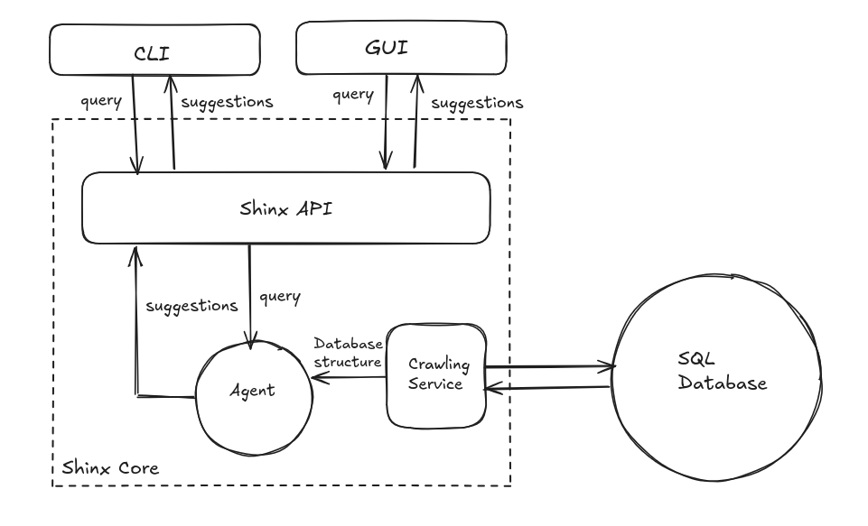

# Architecture

## Overview

## Flow

1. User inputs a query either via the GUI or the CLI.
2. The crawling service crawls over the user database.
3. A structured input is formed by appending the query and the crawling findings.
4. The structured input is passed to an already configured agent (using the system prompt).
5. The agent produces a list of suggestions.

